# Topic Researcher – Autonomous Agent Research

**Objective:**  
The goal of this project is to explore the research capabilities of autonomous agents using the OpenAI Agents SDK, and to experiment with end-to-end information gathering, analysis, and report generation pipelines.

---

## Project Overview

This system consists of **three autonomous agents**. Each agent has a specific responsibility:

1. **SEO Expert Agent**

   - Generates search queries for a given topic.
   - Uses a search tool (`search_query`) to collect relevant URLs.
   - Evaluates the relevance and diversity of results.
   - Returns a curated list of URLs.

2. **Research Agent**

   - Receives URLs from the SEO Expert Agent.
   - Selectively scrapes HTML content using `scrape_url`.
   - Extracts structured insights and notes the source URL for each finding.
   - Ignores non-HTML resources (PDFs, images, videos).

3. **Reporter Agent**

   - Receives the structured research data.
   - Formats it into a **clean Markdown report**.
   - Ensures that all insights clearly reference their sources.
   - Does **not add any interpretations or extra sections**.

## Architecture Diagram

```mermaid
flowchart LR
    A[User Input: Research Topic] --> B[SEO Expert Agent]
    B -->|Generates Search Queries| C[Search Tool: search_query]
    C -->|Returns URLs| D[Research Agent]
    D -->|Scrapes & Extracts Insights| E[Scrape Tool: scrape_url]
    E -->|Structured Data with Sources| F[Reporter Agent]
    F -->|Generates Markdown Report| G[Report Tool: generate_report]
    G --> H[Final Markdown Report]
```



---

## Project Structure

```
topic-researcher/
│
├─ src/
│   ├─ research_agents/
│   │   └─ agents.py
│   │
│   ├─ tools/
│   │   ├─ search_tool.py
│   │   ├─ scraper_tool.py
│   │   └─ report_generator.py
│   │
│   └─ main.py
│
├─ requirements.txt
├─ .gitignore.txt
└─ README.md
```

## Key Features

- **Autonomous multi-agent pipeline**: Each agent performs its task independently and hands off the results to the next agent.
- **Selective scraping**: The Research Agent decides which URLs to consult, ignoring non-HTML content.
- **Batch processing**: `scrape_url` splits page content into 1500-character batches for efficient LLM consumption.
- **Markdown report generation**: Final insights are formatted cleanly with source attribution.

---

## Installation

1. Clone the repository:

```bash
git clone https://github.com/javier-fraga-garcia/topic-researcher.git
cd topic-researcher
```

2. Create and activate a virtual environment (optional but recommended):

```bash
python -m venv venv
source venv/bin/activate  # On Windows use `venv\Scripts\activate`
```

3. Install the required dependencies:

```bash
pip install -r requirements.txt
```

4. Set the environment variables:

```bash
export OPENAI_API_KEY="your_openai_api_key"
export SERPAPI_API_KEY="your_serpapi_api_key"
```

## Usage

The main script accepts a topic as an argument:

```bash
python src/main.py --topic "Sovereignty in European Technology"
```

- `--topic`, `-t`: The research topic to explore.
- The pipeline wil:
  1. Generate search queries and collect URLs.
  2. Scrape and extract insights from the URLs.
  3. Compile a Markdown report with sourced insights.

## Tools Overview

- `search_query`: Performs Google searches programmatically.

- `scrape_url`: Scrapes visible HTML content, removes scripts/styles, splits text into batches.

- `generate_report`: Saves structured insights into a Markdown file with proper UTF-8 encoding.

## License

MIT License – See LICENSE file for details.
